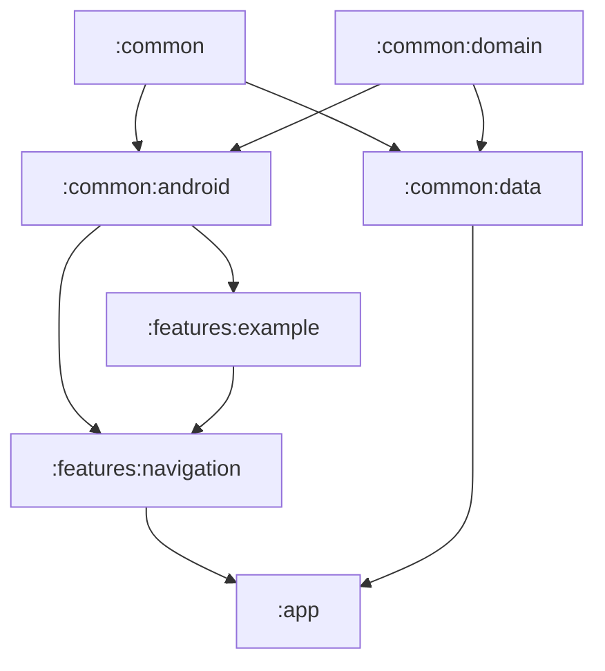

# Compose multimodule example 

## Modules schema:

```mermaid 
graph TD
:common --> :common:android
:common --> :common:data 
:common:domain --> :common:android
:common:domain --> :common:data 

:common:android --> :features:example
:common:android --> :features:navigation
:features:example --> :features:navigation

:features:navigation --> :app
:common:data --> :app
```

